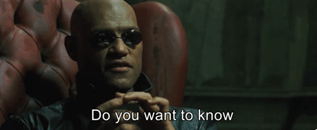
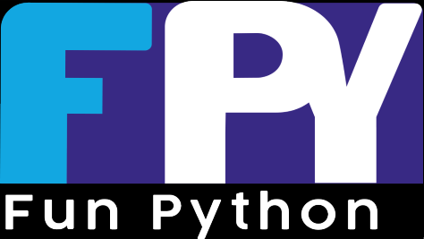
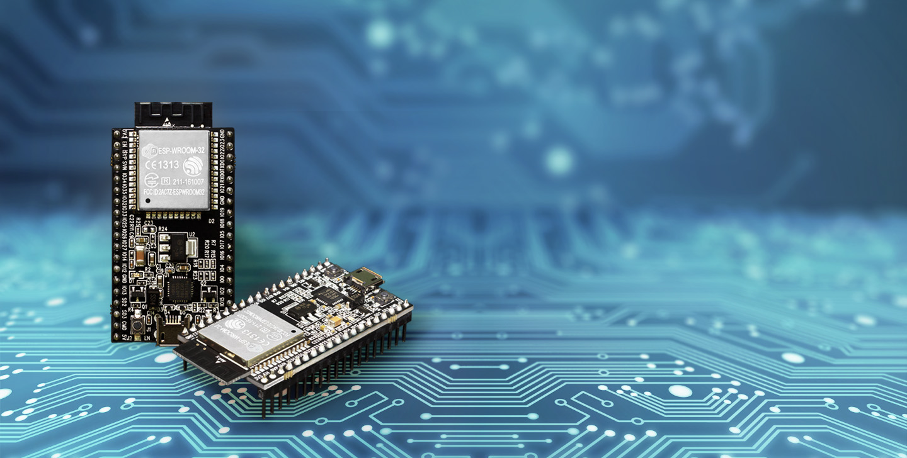
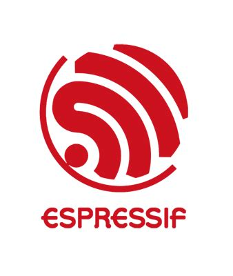
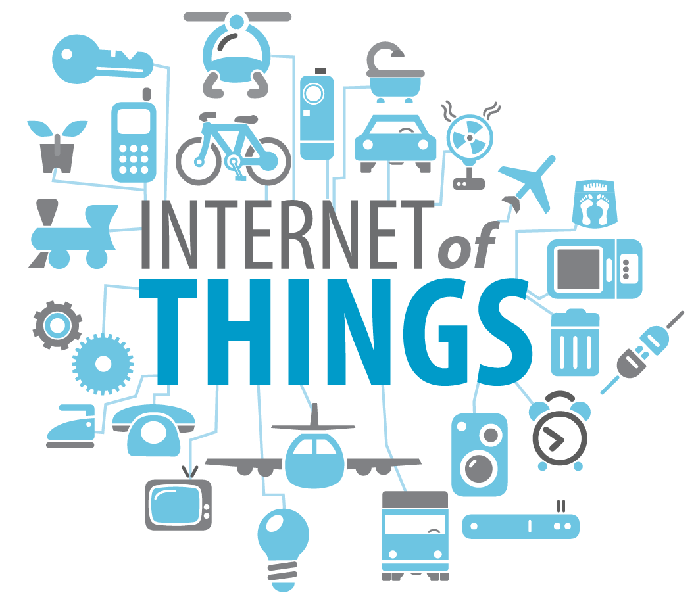
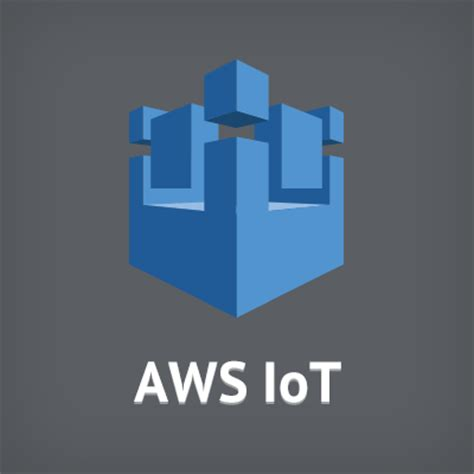
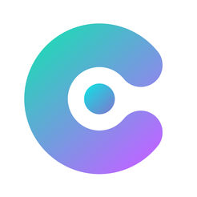
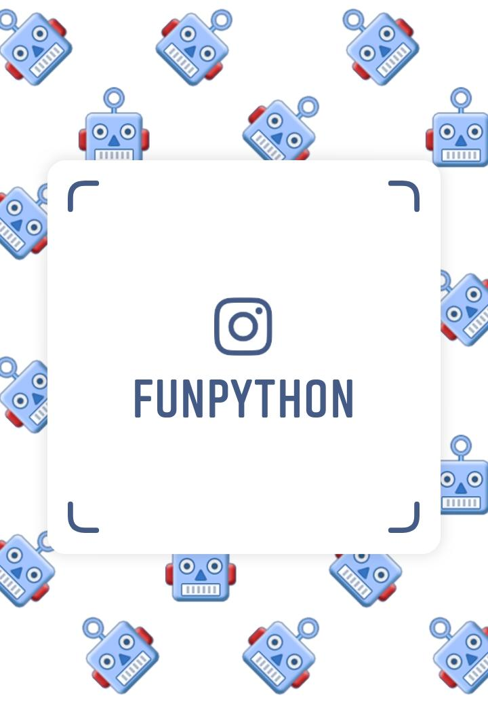

<!-- $theme: gaia -->

# Uso de IoT servers con MicroPython
### Ponentes:
* Jhon Merchan 
* Steven Silva

---

---

## Componentes

---

---

---

---

---

---

### MicroPython

* Python3
* Flexible
* Rapido de aprender
* Sencillo
* Multiplataforma
* Libre

---

### Microcontroladores ESP

* Chip de bajo costo.
* Pila TCP/IP para conexión WiFi.
* Soporta una variedad de lenguajes.

---

### Cloud Services

---

## MQTT y MicroPython

---
<!-- $theme: default -->
## Demostración

### Código

#### Imports

~~~~ python
import network
from robust import MQTTClient
import time
~~~~
---

#### Conexión WiFi

~~~~ python
sta_if = network.WLAN(network.STA_IF)
sta_if.active(True)
sta_if.connect("SSID", "PASS")
time.sleep(5)
~~~~

---
#### Configuración Ubidots items
~~~~ python
ubidotsToken = "ubiotstoken"
clientID = "clientid"
topic=b"/v1.6/devices/esp32lora"
~~~~

#### Creación de objeto MQTT

~~~~ python
client = MQTTClient(clientID, "mqtt://things.ubidots.com", 
	1883, user = ubidotsToken, 
        password = ubidotsToken) #creacion de objeto
client.connect()
~~~~
---

---

# Contacto

* GitHub: https://github.com/FunPythonEC
* Correo: funpython.ec@gmail.com
* Instagram: @funpython
---
<!-- $theme: default -->

