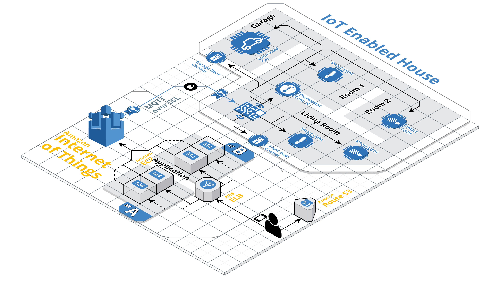

<!--
$theme: gaia
template: invert
-->

# Uso de IoT servers con MicroPython
##### Ponentes:
* Jhon Merchan 
* Steven Silva

---

---

## Infraestructura común de IoT

---

Ejemplo de Internet of Things Architecture de Cloudcraft
[Cloudcraft](https://cloudcraft.co/app)

---

### MicroPython

* Python3 compacta
* Rapido de aprender
* Sencillo
* Multiplataforma
* Libre

---

---

### Microcontroladores ESP

* Chip de bajo costo.
* Pila TCP/IP para conexión WiFi.
* Soporta una variedad de lenguajes.
* Procesador 32 bits
* Memoria flash y RAM

---

### Cloud Services

---

## MQTT y MicroPython

---

## Demostración

### Código

#### Imports

~~~~ python
import network
from umqtt.robust import MQTTClient
import time
~~~~

---

#### Conexión WiFi

~~~~ python
sta= network.WLAN(network.STA_IF)
sta.active(True)
sta.connect("SSID", "PASS")
time.sleep(5)
~~~~

---

#### Configuración Ubidots items
~~~~ python
ubidotsToken = "ubiotstoken"
clientID = "clientid"
topic=b"/v1.6/devices/{devicelabel}"
~~~~

#### Creación de objeto MQTT

~~~~ python
client = MQTTClient(clientID,"mqtt://things.ubidots.com", 
	1883, user = ubidotsToken, 
        password = ubidotsToken) #creacion de objeto
client.connect()
~~~~

---

#### Publish
~~~~ python
msg = b'{"temp":20}'
print(msg)
client.publish(topic, msg)
~~~~

#### Subscribe
~~~~ python
client.set_callback(cb)                    
client.subscribe(bytes(topic, 'utf-8'))

while True:
    try:
        client.wait_msg()
        
    except Exception as e:
        print(e)
        client.disconnect()
~~~~

---

##### Links a repos

* https://github.com/FunPythonEC/MQTT_CLOUD_FLISOL19
* https://github.com/FunPythonEC/ubidots_mqtt_upy

---

# Contacto

* GitHub: https://github.com/FunPythonEC
* Correo: funpython.ec@gmail.com
* Instagram: @funpython

---

<!-- $theme: default -->

