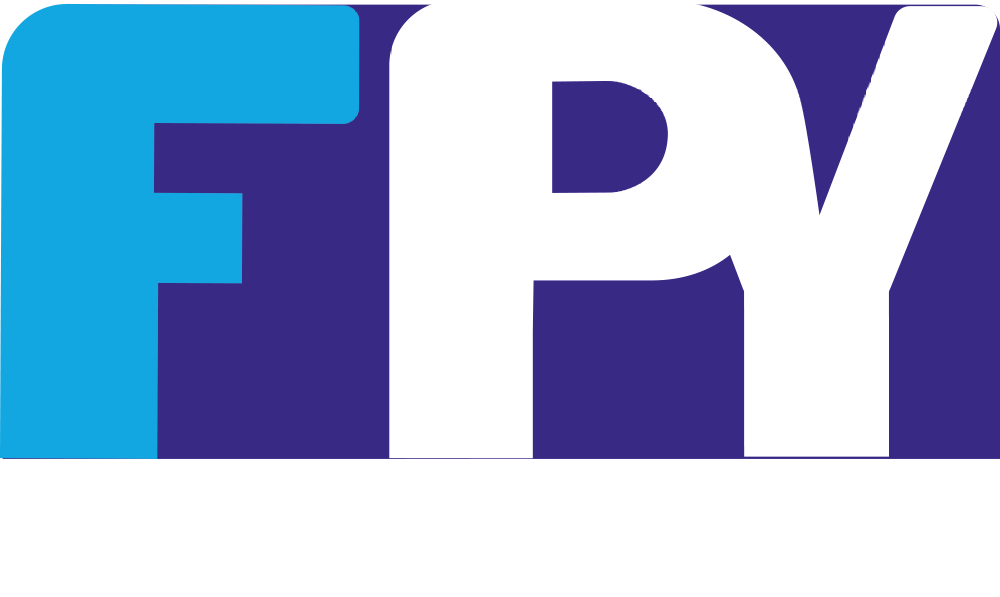

<!-- $theme: default -->

# Uso de IoT servers con MicroPython
### Ponentes:
* Jhon Merchan 
* Steven Silva

---
 

---
## Componentes
---
### MicroPython
---
### Microcontroladores ESP
---
### Cloud Services
---
## MQTT y micropython
---
## Demostración
### Código
